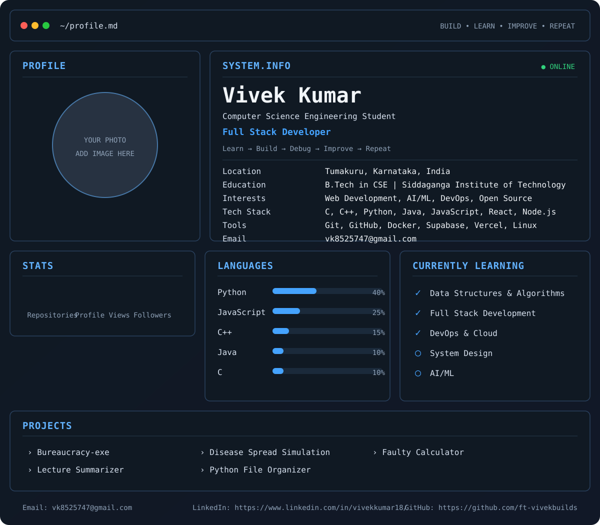

  

## About Me

I'm Vivek Kumar, a Computer Science Engineering student interested in Full Stack Development, AI/ML, DevOps and practical problem solving.

## Tech Stack

`C` `C++` `Python` `Java` `JavaScript` `React` `Next.js` `Node.js` `Supabase` `Git` `Linux` `Docker`

## Featured Projects

- **PARAKH**
- **Bureaucracy-exe**
- **Lecture Summarizer**
- **Disease Spread Simulation**
- **Python File Organizer`

> Edit `data/profile.yml` whenever you want to change the dashboard.
